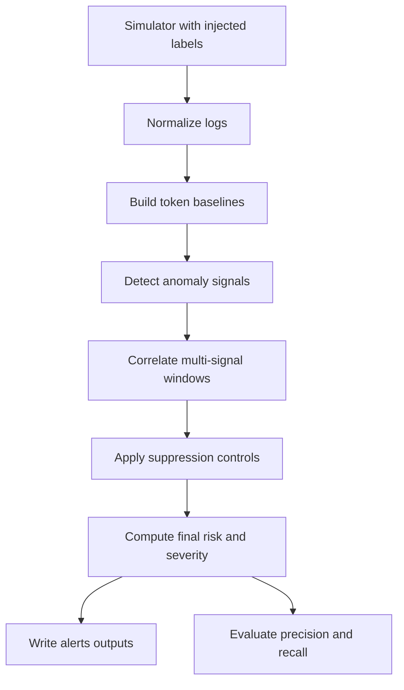

# saas-token-detection

## Final Deliverables

- [x] Correlation + context enrichment working
- [x] False-positive controls (allowlists, thresholds, sensitivity)
- [x] Evaluation using injected anomalies (precision/recall)
- [x] Reproducible demo run (one command)
- [x] Final report + slides + architecture diagram
- [x] Clear limitations + future work

## Problem and Motivation

Long-lived API tokens are convenient but risky. If a token leaks, an attacker can often use it without triggering obvious login failures. This project simulates SaaS API traffic and detects suspicious token behavior by comparing current usage to learned per-token baselines, then adding business context and explainable risk scoring.

## Architecture



## Week 2/3 Input Contract (Frozen)

Canonical normalized input:

- Path: `data/normalized_logs/api_logs_normalized.csv`
- Format: CSV with header row
- Required columns:
  - `event_time`
  - `tenant_id`
  - `token_id`
  - `endpoint`
  - `http_method`
  - `status_code`
  - `ip_address`
  - `geo_country`
  - `auth_method`

Optional evaluation columns (when available):

- `is_injected_anomaly`
- `anomaly_type`

## Simulator and Injection Strategy

The simulator generates realistic baseline traffic per token and injects labeled anomalies in the same run:

- Normal behavior:
  - stable tenant/token identity pairing
  - token-specific endpoint and country preferences
  - mostly-success HTTP status pattern
- Injected anomalies:
  - `volume_spike`
  - `new_geo`
  - `new_endpoint`

All injected records are labeled (`is_injected_anomaly`, `anomaly_type`) so evaluation can compute precision/recall.

## Baselines and Features

For each `(tenant_id, token_id)` baseline:

- Hourly volume statistics: `mean`, `std`, `p95`
- Known sets: countries, IPs, endpoints
- Top endpoints
- Hour-of-day histogram (`0..23`)

Output: `data/baselines/token_baselines.json`

## Detection Rules

Implemented core rules:

- Volume spike:
  - `hour_count > max(p95, mean + sigma * std)`
- New country:
  - `geo_country` unseen for token history
- New IP:
  - `ip_address` unseen for token history
- New endpoint:
  - endpoint unseen and repeated at least `N` times within the hour
- Off-hour (optional signal):
  - requests in hours that are rare in baseline profile

Windows are 1-hour buckets per `(tenant_id, token_id)`.

## Correlation + Context Enrichment

Context source: `config/tenant_context.json`

Per-alert context includes:

- tenant tier and timezone
- expected countries
- tenant allowlisted CIDR ranges
- token type
- sensitive endpoint list

Correlation logic in `detection/correlation.py`:

- Escalate if `new_country` + `volume_spike` occur together
- Escalate if endpoint novelty hits a sensitive endpoint
- Escalate if auth-method drift co-occurs with risky anomaly signals
- Downgrade only when `new_ip` appears in explicitly normal context:
  - geo remains expected/known
  - no volume spike
  - no endpoint novelty
  - auth method remains baseline/expected

Output fields:

- `correlated_signals`
- `correlation_reason`
- `final_risk_score`
- `tenant_context`

## Tenant Isolation Boundary

This project enforces analytical tenant isolation in code by scoring strictly at `(tenant_id, token_id)` and looking up context only by `tenant_id`. It also emits runtime warnings if a token appears under multiple tenants in input data.

This is not infrastructure hard isolation (for example, separate storage accounts, separate compute, or IAM-enforced tenancy boundaries). It is a prototype-level logical isolation guardrail.

## False-Positive Controls

Implemented in `detection/controls.py`:

- warm-up gating by minimum historical hour buckets
- tenant IP allowlist checks (CIDR ranges)
- optional token endpoint allowlist support
- low-volume noise suppression

Output fields:

- `suppressed`
- `suppression_reason`

## Risk Scoring

Base score:

- sum signal weights * correlation multiplier
- multiplier: `1.0` (1 signal), `1.2` (2 signals), `1.5` (3+ signals)
- clamp to `[0, 100]`

Severity bands:

- `high >= 70`
- `medium 40..69`
- `low < 40`

Correlation then adjusts to `final_risk_score`.

## Evaluation Results

Evaluation compares predicted anomalous windows (unsuppressed alerts with score >= 40) against injected-anomaly windows.

- Baseline metrics file: `data/eval/metrics_baseline.json`
- Tuned metrics file: `data/eval/metrics.json`

| Run | High | Medium | Low | Precision | Recall |
| --- | ---: | ---: | ---: | ---: | ---: |
| Before tuning (`baseline`) | 7 | 3 | 0 | 1.0000 | 0.5882 |
| After tuning (`tuned`) | 4 | 4 | 2 | 1.0000 | 0.4706 |

Tuning effect:

- High-severity alerts became rarer (better prioritization).
- Recall dropped because thresholds became more conservative.
- Precision stayed perfect on this synthetic run.

## Reproducible Demo Run (One Command)

From project root:

```bash
./scripts/run_demo.sh
```

PowerShell (Windows):

```powershell
./scripts/run_demo.ps1
```

The script runs:

1. simulator generation
2. normalization
3. baseline profile detection
4. tuned profile detection
5. evaluation for both profiles

## Output Map

- Raw logs: `data/raw_logs/api_logs.jsonl`
- Normalized logs: `data/normalized_logs/api_logs_normalized.csv`
- Baselines:
  - `data/baselines/token_baselines_baseline.json`
  - `data/baselines/token_baselines.json`
- Alerts:
  - `data/alerts/alerts_baseline.jsonl`
  - `data/alerts/alerts_baseline.csv`
  - `data/alerts/alerts.jsonl`
  - `data/alerts/alerts.csv`
- Evaluation:
  - `data/eval/metrics_baseline.json`
  - `data/eval/metrics.json`

## Sample Outputs for Presentation

Prepared in `data/sample_outputs/`:

- `raw_logs_sample.jsonl` (10 lines)
- `normalized_logs_sample.csv` (20 lines)
- `baseline_sample.json`
- `alerts_sample.jsonl` (mixed severities when available)
- `metrics_sample.json`

## Local Setup (without Docker)

```bash
python -m venv .venv
.venv\Scripts\activate
pip install -r ingestion/requirements.txt -r simulator/requirements.txt
./scripts/run_demo.sh
```

PowerShell equivalent:

```powershell
python -m venv .venv
.\.venv\Scripts\Activate.ps1
pip install -r ingestion/requirements.txt -r simulator/requirements.txt
.\scripts\run_demo.ps1
```

## Limitations and Future Work

Limitations:

- simulator traffic is synthetic and simpler than production behavior
- no user/session identity joins, only token-centric features
- CIDR allowlists are static and manually configured
- evaluation is window-level and tied to simulator labels

Future work:

- add seasonality-aware baselines and rolling retraining windows
- incorporate ASN/reputation and geo-distance features
- calibrate risk with tenant feedback loops
- add alert deduplication and incident lifecycle tracking
- benchmark on larger multi-day datasets and add PR curves
