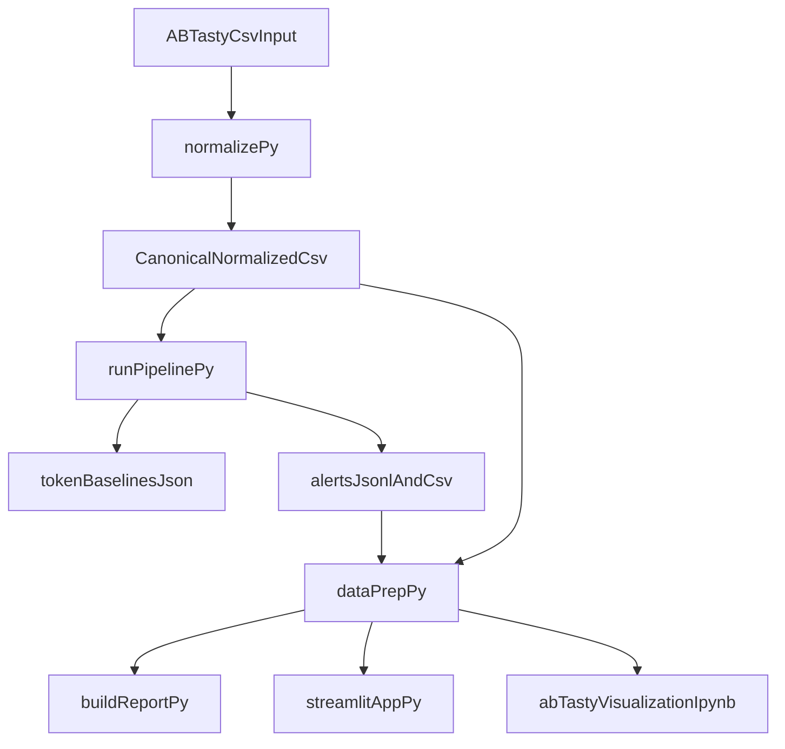

# Codebase Explained (Beginner Guide)

## What this project does

This project detects risky API-token behavior from SaaS access logs.

At a high level, it:

1. reads raw logs (including AB Tasty-style CSV input),
2. standardizes them into one canonical format,
3. builds a baseline of normal token behavior per tenant/token,
4. detects unusual behavior windows,
5. scores each window as `low`, `medium`, or `high` severity,
6. outputs files and visualizations for analysis/presentation.

## End-to-end flow

## Folder map (what is where)

- `ingestion/` - input cleanup and schema normalization
- `detection/` - baseline + anomaly detection + scoring + controls
- `evaluation/` - precision/recall style checks using injected labels
- `visualization/` - report generation + dashboard data prep
- `scripts/` - one-command run scripts
- `data/` - all inputs and generated outputs
- `docs/` - documentation
- `notebooks/` - presentation/demo notebook

## Stage 1: Ingestion and normalization

Main file: `ingestion/normalize.py`

What it does:

- accepts raw input (`.jsonl`, `.json`, or `.csv`)
- auto-detects AB Tasty synthetic CSV structure
- maps source columns to canonical pipeline columns
- writes normalized output to `data/normalized_logs/api_logs_normalized.csv`

Why this matters:

- later stages depend on consistent columns (`event_time`, `tenant_id`, `token_id`, `endpoint`, `status_code`, etc.)
- AB Tasty CSVs can vary; normalization keeps downstream logic stable

## Stage 2: Detection pipeline

Main orchestrator: `detection/run_pipeline.py`

It coordinates these modules:

- `detection/baseline.py` - builds per `(tenant_id, token_id)` behavior profiles
- `detection/rules.py` - finds suspicious windows/signals (new geo, new endpoint, spikes, etc.)
- `detection/scoring.py` - computes risk scores and severity
- `detection/correlation.py` - raises risk when risky signals co-occur
- `detection/controls.py` - suppression/guardrails to reduce noisy alerts

Primary outputs:

- `data/baselines/token_baselines.json`
- `data/alerts/alerts.jsonl`
- `data/alerts/alerts.csv`

## How severity is produced

Severity comes from risk scoring in the detection pipeline:

- `high`: score >= 70
- `medium`: score 40..69
- `low`: score < 40

These severity levels are what you should present for prioritization.

## Stage 3: Evaluation (optional but useful)

Main file: `evaluation/evaluate.py`

Purpose:

- compares predicted alert windows against labeled injected anomalies (if labels exist)
- outputs metrics such as precision and recall

Output:

- `data/eval/metrics.json` (and baseline/tuned variants when run in demo mode)

## Stage 4: Visualization and presentation outputs

Main files:

- `visualization/data_prep.py` - prepares data tables for charts
- `visualization/build_report.py` - builds HTML report
- `visualization/app.py` - Streamlit dashboard
- `notebooks/ab_tasty_visualization.ipynb` - notebook walkthrough

Presentation-ready outputs:

- HTML report: `data/reports/ab_tasty_report.html`
- Streamlit app (interactive): run `streamlit run visualization/app.py`
- Notebook: `notebooks/ab_tasty_visualization.ipynb`

## Important scripts (easy entry points)

- `scripts/run_ab_tasty_analysis.ps1` - normalize + detect
- `scripts/run_ab_tasty_viz.ps1` - normalize + detect + HTML report
- `scripts/run_demo.ps1` - simulator flow with baseline/tuned/evaluation
- `scripts/generate_best_ab_tasty_csv.py` - generate large enriched dataset

## Data artifacts you will see in `data/`

- `data/raw_logs/` - raw source datasets
- `data/normalized_logs/` - canonical normalized CSV
- `data/baselines/` - per-token baseline profiles
- `data/alerts/` - alert outputs with scores/severity
- `data/eval/` - evaluation metrics
- `data/reports/` - generated HTML report

## If you're presenting this project

Use this order:

1. open `data/reports/ab_tasty_report.html` (quick story + visuals),
2. open dashboard (`streamlit run visualization/app.py`) for filtering,
3. open notebook for step-by-step walkthrough if needed.
